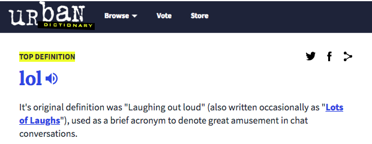

# What makes a new word stick?

The language that people use to communicate online is in constant flux.
People may have once written "haha" to indicate laughter but over time have adopted "lol" as a convention for laughter.
Entire dictionaries and websites such as UrbanDictionary.com are dedicated to tracking the ebb and flow of the latest slang words that propagate across society online.

Such language change often attributed to social processes such as membership turnover,  where new members join a platform and bring in new words while old members leave and are forgotten.
In general, it is assumed that a nonstandard word such as "lol" achieves success based on the proportion of people or sub-communities that adopt the word.
However, it is less often considered how a new word's function can help it "survive" other similar words.
If a word like "lol" can occur in a wide range of linguistic contexts, will that give it an edge to outlive the other competing words?
Furthermore, are its linguistic properies more important than its social adoption?
This is a critical question that can help linguists understand language change, and it can also help social scientists understand the limits of social theory as explanation for adoption of innovations.

Our work compares the relative importance of social and linguistic "dissemination" across contexts in explaining the growth and decline of nonstandard words in Reddit over a 3-year period.
Here, **social dissemination** refers to the relative number of Reddit users, communities and threads in which a word appears, normalized by the expected count based on prior assumptions about word use.
Similarly, **linguistic dissemination** refers to the relative number of contexts in which a word occurs: for instance, the adjective "trashy" occurs in an unusually high number of contexts as compared to the abbreviation "lmao" which usually occurs at the beginning or end of a sentence.

We perform a number of statistical tests to compare the relative importance of social and linguistic dissemination, which include logistic regression, causal inference, and survival analysis.
Overwhelmingly, linguistic dissemination is a better predictor of word frequency change than social dissemination.
Linguistic dissemination can differentiate a future growing word from a future declining word even when controlling for relative frequency, shown in the plot below where we compare the prediction accuracy over several models (f indicates word frequency alone, f+L indicates frequency with linguistic dissemination, f+S indicates frequency with social dissemination, f+L+S indicates all factors).
Furthermore, linguistic dissemination can accurately forecast the point of "death" for declining words (ex. when "lol" starts to fall out of favor) months in advance, while social dissemination cannot forecast this as accurately.
Although the models used are relatively simple, they reveal new insight into patterns in nonstandard word usage.

Future work should look into more fine-grained definitions of linguistic flexibility, such as using syntactic n-gram contexts rather than just word n-gram contexts.
If you want to make words like "fetch" happen, it may just take more linguistic flexibility. 
Exercise for the reader: how flexible can you make the word "fetch"?

